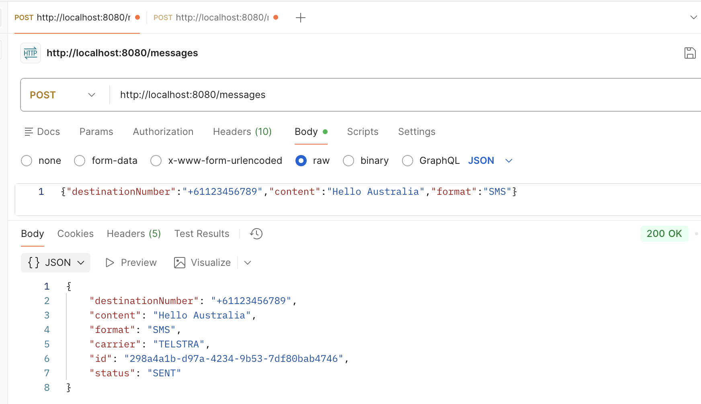
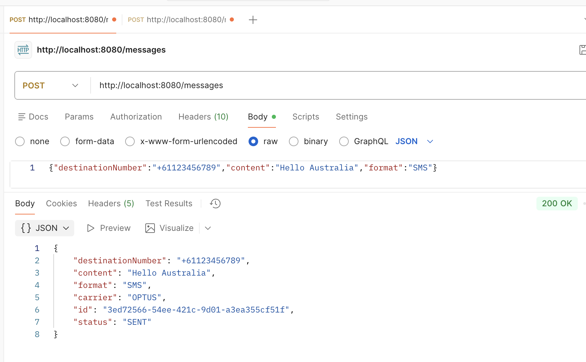
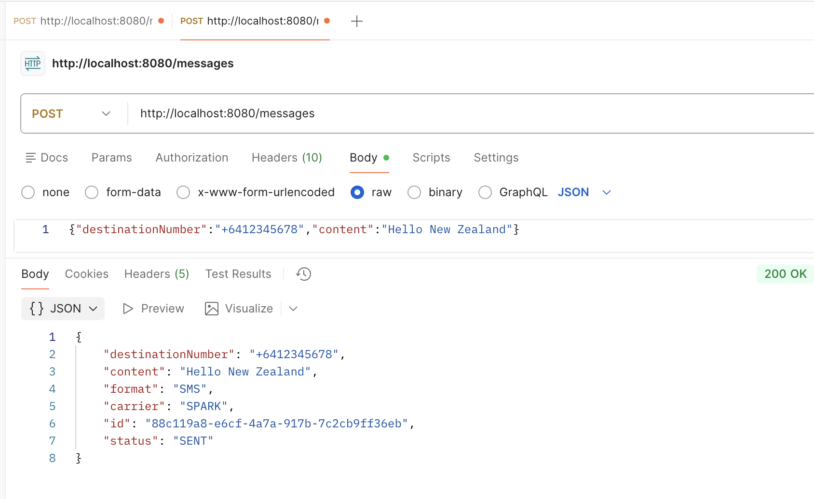
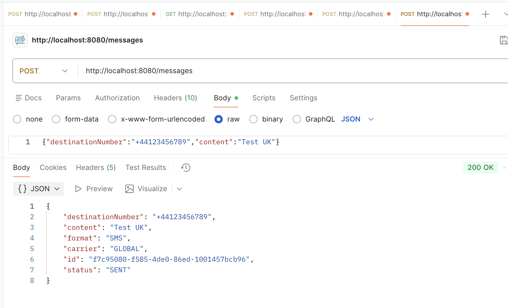
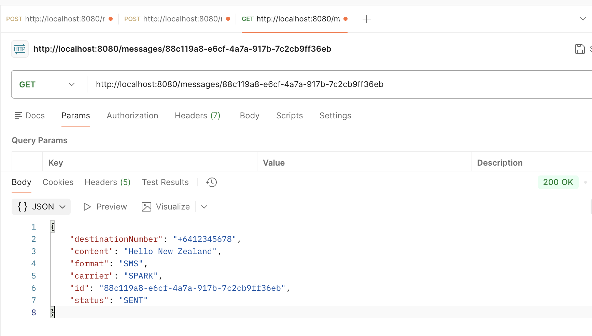
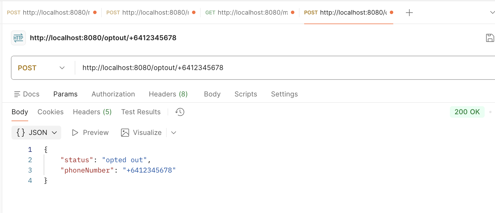
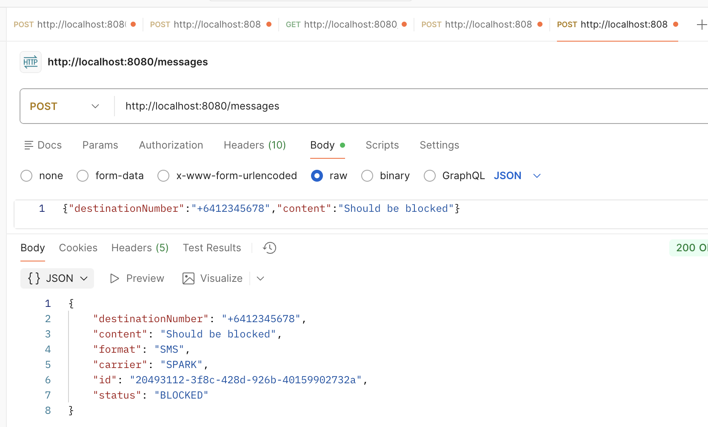

# SMS Routing Service

A simple SMS routing service built with Java and Spring Boot that handles message routing, opt-outs, and carrier selection.

## Features
- Send SMS messages via REST API
- Route messages by carrier (AU/NZ based on phone prefix)
- Handle opt-out management
- Track message delivery status
- In-memory storage (ConcurrentHashMap and Set)
- Thread-safety (Accounts for future-proofing multiple requests at one time)

## Technology Stack
- Java 21
- Spring Boot 4.0.1
- Maven

## Project Status
- [x] Step 1: Set up project
- [x] Step 1b: Git repository and documentation initialized
- [x] Step 2: Core domain models
- [x] Step 3: Create in-memory Message storage / repository
- [x] Step 4: Create base Message and Carrier Service structure
- [x] Step 5: Implement carrier routing logic
- [x] Step 6: Build REST controllers
- [x] Step 7: Add validation / error handling
- [x] Step 8: Write unit tests

## API Endpoints (To be implemented)

### Send Message
```
POST /messages
Content-Type: application/json

{
    "destinationNumber": "+6412345678",
    "content": "Test message",
    "format": "SMS"
}
```

### Get Message Status
```
GET /messages/{id}
```
Statuses:
- PENDING
- SENT
- DELIVERED/BLOCKED

### Opt-out Number
```
POST /optout/{phoneNumber}
```

## Building and Running

### Build
```bash
mvn clean install
```

### Run
```bash
mvn spring-boot:run
```

Go to `http://localhost:8080`

## Testing
- Unit testing
- Curl commands (can copy/paste to verify in-console)
- Postman collection (I will provide this in the README)

### Endpoint test run - screenshots

**Send a message to AU**

Telstra:

Optus:


**Send a message to NZ**


**Send a message to UK (Global)**


**Get message status**


**Opt out**


**Confirm opted out numbers are blocked**


## Project Structure
```
src/
├── main/
│   └── java/com/smsrouting/
│       ├── controller/
│       │   └── MessageController.java
│       ├── model/
│       │   ├── Carrier.java
│       │   ├── Message.java
│       │   └── MessageStatus.java
│       ├── repository/
│       │   └── MessageRepository.java
│       ├── service/
│       │   └── CarrierService.java
│       │   └── MessageService.java
│       └── SmsRoutingServiceApplication.java
└── test/
    └── java/com/smsrouting/
        └── CarrierServiceTests.java
        └── MessageServiceTests.java
        └── SmsRoutingServiceApplicationTests.java
        
```

## Design Decisions / Assumptions
- I explicitly did not use Lombok. Even though it's useful for reducing boilerplate code (i.e. getters/setters), I 
  figured given this is a small project it wouldn't be necessary - also to avoid the need for the lombok plugin 
  within the project.
- I used ENUMs for `Carrier` and `MessageStatus` for a cleaner, limited set of values, and to give the values 
  'type-safety' (i.e. avoid mistyping a status). It just keeps the code cleaner and more organised/structured.

## Future considerations / Improvements (time-permitting)
- Generate each message with a `createdAt` timestamp.
- Split off `MessageRepository` and `OptOutRepository` into two separate in-memory repos. 
- Strip phone numbers of spaces (i.e. `+64 123 456 7890` becomes `+641234567890`) --> currently assuming all input 
  numbers do not contain spaces.