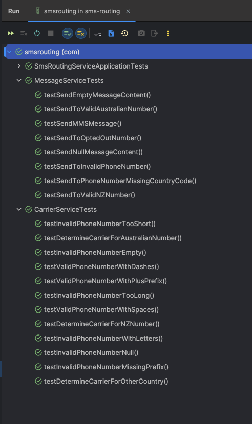
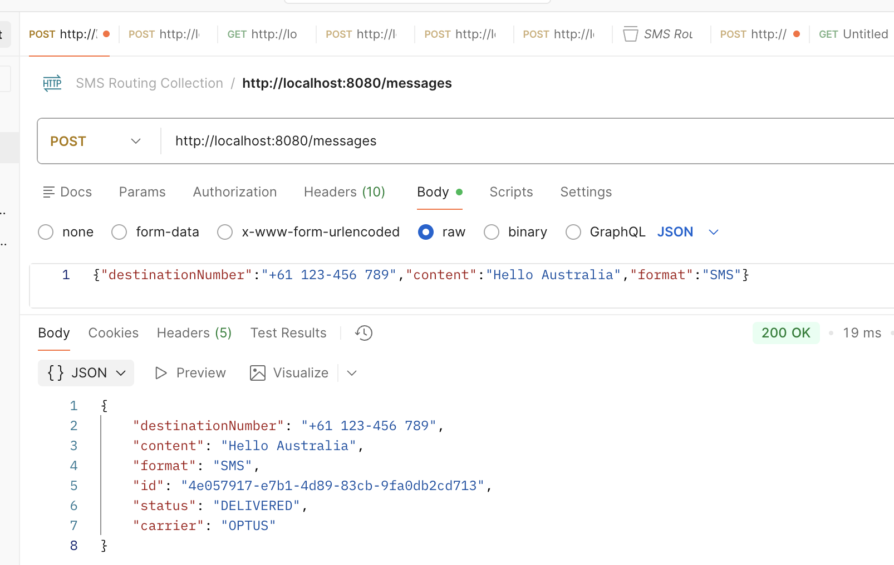

# SMS Routing Service

A simple SMS routing service built with Java and Spring Boot that handles message routing, opt-outs, and carrier selection.

## Features
- Send SMS messages via REST API
- Route messages by carrier (AU/NZ/Global based on phone prefix)
- Handle opt-out management
- Track message delivery status
- In-memory storage (ConcurrentHashMap and Set)
- Thread-safety (Accounts for future-proofing multiple requests at one time)

## Technology Stack
- Java 21
- Spring Boot 3.4.1
- JUnit 5
- Maven

## Project Status
- [x] Step 1: Set up project
- [x] Step 1b: Git repository and documentation initialized
- [x] Step 2: Core domain models
- [x] Step 3: Create in-memory Message storage / repository
- [x] Step 4: Create base Message and Carrier Service structure
- [x] Step 5: Implement carrier routing logic
- [x] Step 6: Build REST controllers
- [x] Step 7: Add validation / error handling
- [x] Step 8: Write unit tests
- [x] Step 9: Clean up code & refine README

## API Endpoints (To be implemented)

### Send Message
```
POST /messages
Content-Type: application/json

{
    "destinationNumber": "+6412345678",
    "content": "Test message",
    "format": "SMS"
}
```

### Get Message Status
```
GET /messages/{id}
```
Statuses:
- PENDING
- SENT
- DELIVERED/BLOCKED

### Opt-out Number
```
POST /optout/{phoneNumber}
```

## Building and Running

### Build
```bash
mvn clean install
```

### Run
```bash
mvn spring-boot:run
```

## Testing
- Unit testing (run `mvn test`)
- Curl commands (can copy/paste to verify in-console):

    ```bash
    curl -X POST http://localhost:8080/messages \
    -H "Content-Type: application/json" \
    -d '{"destinationNumber":"+61123456789","content":"Hello Australia","format":"SMS"}'
    ```
- Postman collection - found here: https://coltonrandall-6575257.postman.co/workspace/Colton-Randall's-Workspace~43319d0a-6c79-4116-87ee-3caecc1dda62/collection/43484858-df44e1d3-e164-41fd-ad36-e7c66bd9edef?action=share&source=copy-link&creator=43484858

#### Tests passing:


### Endpoint test run - screenshots

**Send a message to AU**

Telstra:

Optus:

Phone number with spaces / dashes:


**Send a message to NZ**


**Send a message to UK (Global)**


**Get message status**


**Opt out**


**Confirm opted out numbers are blocked**


## Project Structure
```
src/
├── main/
│   └── java/com/smsrouting/
│       ├── controller/
│       │   └── MessageController.java
│       ├── model/
│       │   ├── Carrier.java
│       │   ├── Message.java
│       │   └── MessageStatus.java
│       ├── repository/
│       │   └── MessageRepository.java
│       ├── service/
│       │   └── CarrierService.java
│       │   └── MessageService.java
│       └── SmsRoutingServiceApplication.java
└── test/
    └── java/com/smsrouting/
        └── CarrierServiceTests.java
        └── MessageServiceTests.java
        └── SmsRoutingServiceApplicationTests.java
        
```

## Design Decisions / Assumptions
- I explicitly did not use Lombok. Even though it's useful for reducing boilerplate code (i.e. getters/setters), I 
  figured given this is a small project it wouldn't be necessary - also to avoid the need for the lombok plugin 
  within the project.
- I used ENUMs for `Carrier` and `MessageStatus` for a cleaner, limited set of values, and to give the values 
  'type-safety' (i.e. avoid mistyping a status). It just keeps the code cleaner and more organised/structured.
- Every `Message` object is created with a  default status of `PENDING`.
- I have assumed each number should start with a "+" and be between 8-15 numbers long.
- Input is automatically standardised - spaces, dashes, and special characters are removed for processing
  - Example: `+64 123-456 789` → `+64123456789`. Note - the API response still shows what the user put in (i.e. `+64 123-456 789`)
  - Numbers with spaces or dashes are still considered **valid**.
  - Numbers containing letters are **invalid**.
- The transition from SENT to DELIVERED is **immediate** in this project.
  - In production, DELIVERED status would be set asynchronously via carrier webhook/callback.
- AU numbers (+61) **alternate** between Telstra and Optus for this project for simplicity, and to demonstrate multiple 
  carrier functionality.
- Opted out messages are still created and saved but with a **BLOCKED** status, which allows for auditing which 
  numbers are blocked for future use.
- In-memory storage uses a ConcurrentHashMap for thread-safety, since, in production multiple messages may be being 
  sent to one number at a given time, and will store messages against their `messageId`.
- Opted-out numbers use `ConcurrentHashMap.newKeySet()` instead of `HashSet` because `HashSet` is not thread-safe. 
  This ensures concurrent opt-out operations don't cause issues/data corruption.

## Future considerations / Improvements (time-permitting)
- Database persistence 
- Async delivery - receive real-time carrier delivery confirmation instead of simulating it.
- Monitoring and logging for latency / failures and alerting for system issues